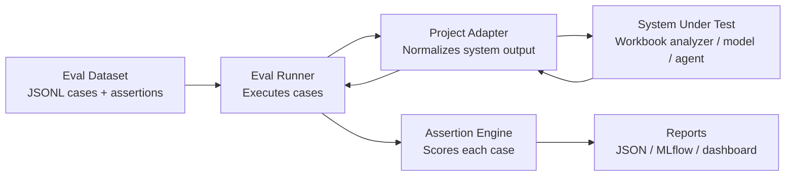
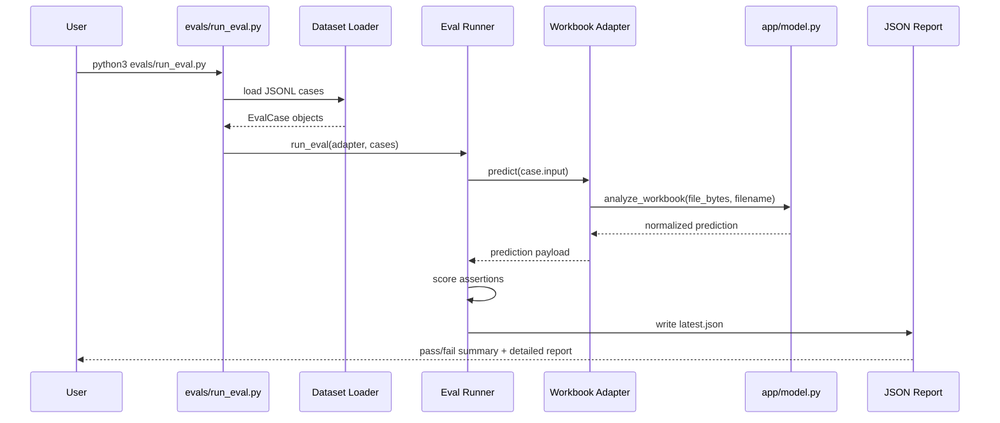
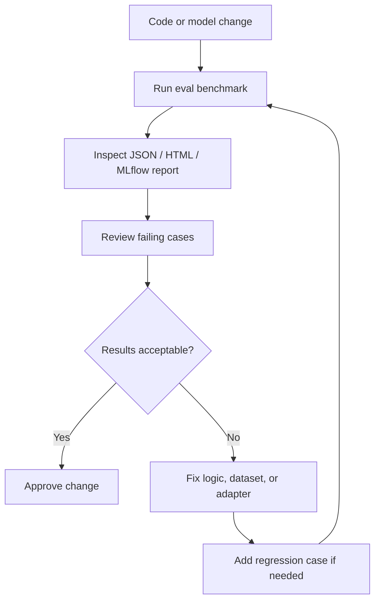
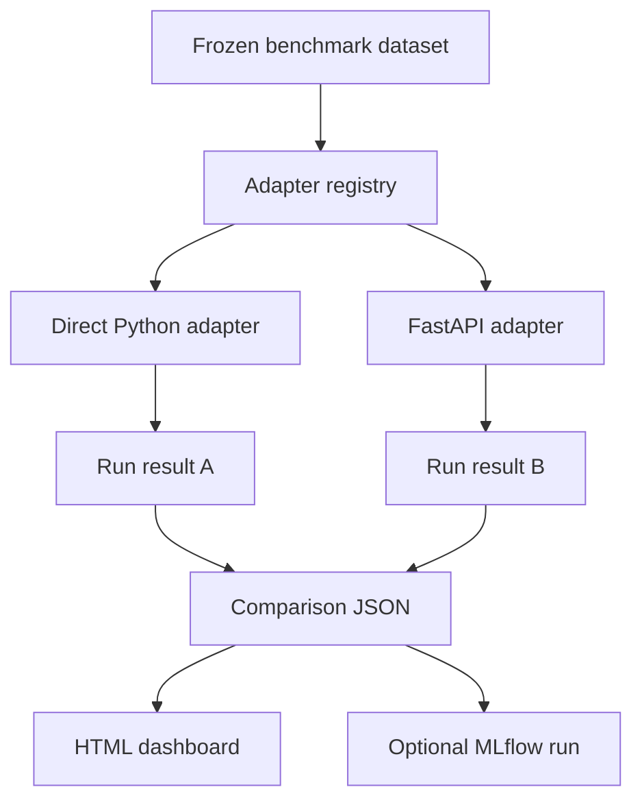
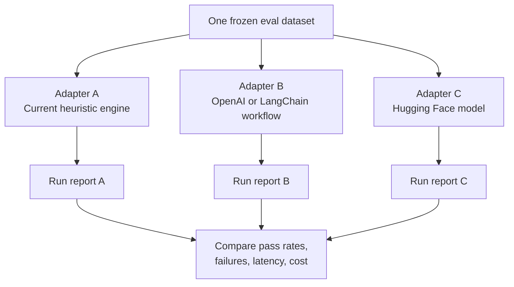

# Evaluation Framework

This project now includes a separate reusable evaluation framework. The goal is to keep product logic and evaluation logic independent so the same eval system can be reused in other repositories with only a new adapter and dataset.

## Why Separate Evals

The application in [`app/model.py`](/Users/syedraza/multiagent-dataanalysis/app/model.py) answers workbook-analysis requests. The eval framework answers a different question: how do we measure quality consistently across versions, models, prompts, or frameworks.

That separation matters because:

- product code should focus on serving predictions
- eval code should focus on benchmark datasets, assertions, reports, and comparisons
- the same eval runner should be able to test this workbook analyzer, a FastAPI service, an LLM workflow, or a Hugging Face model through different adapters

## How This Framework Helps

This framework is useful because it turns quality checking into a repeatable engineering process instead of an informal manual review.

In practice it helps in these ways:

- it gives you one benchmark that can be reused across multiple implementations
- it makes model or framework comparisons fair because the same dataset and scoring logic are reused
- it catches regressions when logic changes but the API still appears to work
- it provides structured evidence for release decisions instead of opinion-based judgment
- it keeps failure cases visible so teams can improve weak spots deliberately
- it separates product development from evaluation logic, which makes both easier to maintain

For this project specifically, the framework helps answer questions like:

- did the workbook analyzer still infer the right dataset type after a heuristic change
- did the API path return the same behavior as the direct Python path
- did confidence or issue detection drift after code changes
- is one adapter slower or less reliable than another

## Business Value

This matters beyond engineering hygiene.

- teams can compare versions before rollout instead of discovering quality drops in production
- managers get a clear pass/fail and report artifact instead of a vague claim that the system "looks correct"
- model changes become auditable because each run can be logged to JSON, HTML, and MLflow
- release gates become cheaper because the benchmark can be rerun automatically

In short, the framework reduces rework, improves traceability, and makes system quality easier to defend.

## Architecture



## Directory Layout

```text
eval_framework/
├── adapters.py       # Base adapter contract
├── datasets.py       # JSONL dataset loader
├── metrics.py        # Assertion evaluation logic
├── registry.py       # Adapter registry for multi-run comparisons
├── reporter.py       # JSON report writer
├── runner.py         # Core eval execution
└── __init__.py

evals/
├── cases/
│   └── workbook_cases.jsonl
├── api_adapter.py
├── compare_adapters.py
├── registry.py
├── workbook_adapter.py
└── run_eval.py
```

## Eval Flow



## Dataset Standard

The framework uses assertion-based JSONL. Each line is one case.

Example:

```json
{
  "id": "sales_clean_financial",
  "input": {
    "path": "samples/sales.csv",
    "filename": "sales.csv"
  },
  "assertions": [
    {"path": "dataset_type", "op": "eq", "value": "financial"},
    {"path": "summary.total_rows", "op": "eq", "value": 4},
    {"path": "confidence", "op": "gte", "value": 0.55}
  ],
  "tags": ["smoke", "financial"]
}
```

This format is reusable because it does not assume a specific model family. It only assumes the adapter returns a predictable output schema.

## Supported Assertion Operators

- `eq`: exact equality
- `neq`: exact inequality
- `gte`: greater than or equal
- `lte`: less than or equal
- `contains`: value is present in a list or string
- `not_contains`: value is absent from a list or string
- `len_eq`: collection length equals value
- `in`: actual value exists inside the expected collection

## Current Project Integration

The first project adapter is [`evals/workbook_adapter.py`](/Users/syedraza/multiagent-dataanalysis/evals/workbook_adapter.py). It reads a file from disk, calls [`analyze_workbook()`](/Users/syedraza/multiagent-dataanalysis/app/model.py#L65), and returns the existing app output without modifying the product code.

That means the eval is exercising the same analysis path used by the API.

This repo now includes two adapters:

- [`workbook_adapter.py`](/Users/syedraza/multiagent-dataanalysis/evals/workbook_adapter.py): evaluates the Python analysis function directly
- [`api_adapter.py`](/Users/syedraza/multiagent-dataanalysis/evals/api_adapter.py): evaluates the FastAPI route through `TestClient`

That gives you a concrete example of comparing the same system through two different execution frameworks while keeping the dataset and assertions identical.

## How To Run

```bash
python3 evals/run_eval.py
```

Optional flags:

```bash
python3 evals/run_eval.py \
  --adapter fastapi-api \
  --dataset evals/cases/workbook_cases.jsonl \
  --report evals/reports/latest.json
```

Compare multiple adapters on the same benchmark:

```bash
python3 evals/compare_adapters.py
```

Optional MLflow logging:

```bash
python3 evals/run_eval.py --log-mlflow
python3 evals/compare_adapters.py --log-mlflow
```

Make targets:

```bash
make eval
make eval-compare
```

## What Gets Reported

The runner writes a JSON report with:

- adapter name
- framework name
- total and passed case counts
- total and passed assertion counts
- pass rate
- assertion pass rate
- total and average latency in milliseconds
- per-case assertion results
- raw prediction payload for debugging failures

The comparison CLI also writes:

- one JSON report per adapter
- a summary JSON report
- an HTML dashboard for side-by-side viewing
- optional MLflow run metadata and report artifacts

## How To Validate Eval Results

An eval framework is only useful if the results themselves are trustworthy. Validation should happen at three levels: dataset quality, scorer quality, and system-output quality.

### 1. Validate The Dataset

Make sure the benchmark cases are correct before trusting the scores.

- review each gold case manually
- make expected values explicit and unambiguous
- include both clean cases and failure cases
- version the dataset so changes are traceable
- keep a frozen regression set for release checks

For this repo, that means reviewing [`workbook_cases.jsonl`](/Users/syedraza/multiagent-dataanalysis/evals/cases/workbook_cases.jsonl) and confirming that each assertion reflects the intended behavior of the analyzer.

### 2. Validate The Scoring Logic

The framework should be tested independently of the product being evaluated.

- unit test assertion operators like `eq`, `contains`, `gte`, and `in`
- verify nested field resolution such as `summary.total_rows`
- test both passing and failing cases
- inspect generated reports to confirm expected versus actual values are rendered correctly

The current smoke coverage for this exists in [`test_eval_framework.py`](/Users/syedraza/multiagent-dataanalysis/tests/test_eval_framework.py).

### 3. Validate The Adapter

Each adapter must faithfully represent the system under test.

- confirm the adapter calls the real execution path
- confirm the adapter does not rewrite outputs in a misleading way
- compare two adapters against the same dataset when possible

This repo already demonstrates that pattern:

- [`workbook_adapter.py`](/Users/syedraza/multiagent-dataanalysis/evals/workbook_adapter.py) validates the direct Python path
- [`api_adapter.py`](/Users/syedraza/multiagent-dataanalysis/evals/api_adapter.py) validates the FastAPI path

If both adapters pass the same benchmark, that increases confidence that the eval is measuring real behavior rather than adapter-specific behavior.

### 4. Validate With Human Review

Some tasks cannot be fully trusted through automated assertions alone.

Use human review when:

- outputs are subjective
- recommendations are phrased differently but may still be correct
- there are multiple acceptable answers
- you are evaluating an LLM or agent workflow with open-ended responses

The standard pattern is:

- run automated eval first
- inspect failing cases manually
- promote important failures into permanent regression cases

### 5. Validate Over Time

A single passing run is not enough. Trust comes from consistency across versions.

- compare current results to a previous baseline
- review pass rate, assertion pass rate, and latency together
- inspect newly failing cases first
- log important runs to MLflow so historical drift is visible

## Recommended Validation Workflow



## What Good Validation Looks Like

You can treat eval results as credible when:

- the dataset is reviewed and versioned
- the assertions are tested
- the adapter exercises the real system path
- reports are reproducible across reruns
- important failures are manually inspected
- regressions are added back into the benchmark

If those conditions are missing, an eval score is only a rough signal, not a reliable decision tool.

## Comparison Workflow



## MLflow Integration

MLflow is optional and acts as the tracking layer for eval history. When enabled, the framework logs:

- adapter name and framework
- total cases and assertions
- case pass rate
- assertion pass rate
- average latency
- generated JSON and HTML reports as artifacts

This gives you a reusable eval history across projects without coupling the benchmark runner to a specific UI.

## HTML Dashboard

The comparison CLI writes an HTML report designed for quick review. It includes:

- a summary table for each adapter
- case pass rates and assertion pass rates
- average latency
- expandable failing-case details with expected versus actual values

This is intentionally lightweight. It is useful when you want a visual artifact without standing up a separate application.

## Reuse In Other Projects

To reuse this framework elsewhere:

1. Copy or package `eval_framework/` as a shared library.
2. Create a new project adapter that implements `EvalAdapter`.
3. Create a project-specific dataset in the same JSONL assertion format.
4. Register the adapter in a project-local registry.
5. Add thin CLI entrypoints like `run_eval.py` and `compare_adapters.py`.
6. Optionally attach reporters for MLflow, HTML, or dashboards.

Minimal adapter example:

```python
from eval_framework.adapters import EvalAdapter


class MyAdapter(EvalAdapter):
    name = "my-model"

    def predict(self, sample_input: dict) -> dict:
        return {"label": "ok", "score": 0.91}
```

## Comparing Different Models Or Frameworks

Use the same dataset and assertions, then swap adapters.



This is the standard pattern for fair comparison:

- same benchmark inputs
- same scoring rules
- different adapters
- versioned reports
- comparable latency and cost capture

Examples of what those adapters can wrap:

- direct Python business logic
- FastAPI or Flask endpoints
- LangChain or LangGraph workflows
- OpenAI model calls
- Hugging Face pipelines
- local PyTorch or scikit-learn models

## Recommended Next Steps

- add cost capture for hosted-model adapters
- add regression cases whenever a bug is fixed
- freeze a small test set for release gating and a larger dev set for iteration
- package `eval_framework/` as a reusable internal library or separate repo
