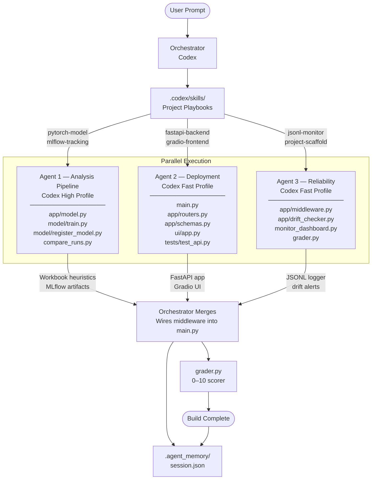

# multiagent-dataanalysis

An end-to-end Excel and CSV analysis system built with FastAPI, Gradio, pandas, and MLflow, assembled by a Codex agent team working in parallel.

## Agent Team Architecture



## What the Project Does

The API accepts `.xlsx`, `.xls`, and `.csv` files and returns workbook-level analysis:

- sheet counts and dataset type inference
- row, column, missing-cell, and duplicate summaries per sheet
- numeric-column summaries and sample row previews
- confidence scoring plus recommendations for cleanup or reporting

The UI provides an upload flow for workbook inspection, while the monitoring layer logs every analysis to `logs/predictions.jsonl` and raises drift alerts when average confidence drops.

## Multi-Agent Structure

The project keeps the same three-part multi-agent layout:

- Analysis pipeline agent: workbook parsing, heuristics, MLflow artifact generation, run comparison
- Deployment agent: FastAPI `/api/analyze` and `/api/health`, schemas, Gradio interface, API tests
- Reliability agent: analysis logging middleware, drift checks, CLI dashboard, grader and rerun logic

This preserves the original orchestration style while removing the old image-analysis domain.

## Agentic Development Benefits

This project is a good fit for agentic development because the work naturally breaks into independent areas. Workbook analysis logic, API and UI delivery, and operational reliability are related, but they do not need to be implemented in one long sequential thread. Splitting them into dedicated agents reduces context switching, shortens build time, and makes ownership clear.

The main efficiency gain comes from parallel execution. Instead of having one agent read every file, hold the entire system in context, and build each layer one by one, the orchestrator assigns clear file boundaries and runs the agents at the same time. That means:

- the analysis agent can focus on workbook heuristics and MLflow artifacts
- the deployment agent can focus on user-facing delivery through FastAPI and Gradio
- the reliability agent can focus on logging, monitoring, grading, and rerun criteria

This separation reduces collisions and avoids the common problem where one large agent repeatedly re-reads the whole codebase for every small change.

## Why This Is More Efficient

The project uses task-based routing instead of treating every coding step as equally hard. Some work needs stronger reasoning, while some work is mostly structured implementation. The orchestrator takes advantage of that difference.

### High-reasoning work

The analysis pipeline agent uses the stronger Codex profile because it handles the parts where a wrong decision is expensive:

- designing workbook quality heuristics
- deciding how confidence should be calculated
- shaping recommendation logic
- choosing what to log into MLflow and how to compare runs

These are decisions with architectural consequences. Using a stronger reasoning profile here reduces rework.

### Fast-execution work

The deployment and reliability agents use the faster Codex profile for work that is more mechanical:

- API route wiring
- schema definitions
- Gradio UI plumbing
- JSONL logging
- dashboard formatting
- scaffold and grading glue

These tasks still matter, but they do not need the same level of expensive reasoning. Using a lighter profile keeps cost lower while still producing correct output quickly.

## Cost-Effective Model Usage

The project is cost-effective because it does not spend high-end reasoning capacity on everything.

The routing strategy is simple:

- use the stronger profile only for decisions that affect system behavior or design quality
- use the faster profile for implementation tasks that are already well-bounded
- keep file ownership strict so agents do not overwrite each other and force reruns

This matters in practice because the most expensive part of agentic development is not just tokens, it is wasted cycles. If a strong model is used for boilerplate, you pay more than necessary. If a cheap model is used for architectural reasoning, you may save money early but lose time later fixing the result. This project balances that by assigning the cheapest capable profile for each category of work.

## Why The Project Works Well With This Approach

The codebase benefits from this agent split because each part has a different engineering character:

- the analysis layer is logic-heavy and judgment-heavy
- the API and UI layer is integration-heavy and structure-heavy
- the reliability layer is operations-heavy and validation-heavy

That makes it a strong example of why agentic development is better than a single monolithic session for medium-sized systems. The project can move faster, stay more organized, and use compute budget more carefully.

## Practical Outcome

By adopting this model-aware multi-agent workflow, the project gains:

- faster implementation through parallel work
- clearer separation of concerns
- lower cost from smarter profile selection
- fewer merge conflicts because each agent owns specific files
- easier recovery because grading and checkpoints make reruns targeted instead of global

In short, the system is not just multi-agent for presentation value. The split directly improves delivery speed, code organization, and cost efficiency.

## Project Structure

```text
multiagent-dataanalysis/
├── app/
│   ├── model.py               # Workbook analysis engine
│   ├── routers.py             # /analyze and /health endpoints
│   ├── schemas.py             # Pydantic response models
│   ├── middleware.py          # JSONL analysis logger
│   └── drift_checker.py       # Confidence-based drift detection
├── model/
│   ├── cnn.py                 # Workbook profiling placeholder model
│   ├── train.py               # Batch workbook profiling + MLflow logging
│   └── register_model.py      # Registers workbook profile artifact to MLflow
├── ui/
│   └── app.py                 # Gradio workbook analysis UI
├── tests/
│   └── test_api.py            # API tests for analyze and health endpoints
├── main.py                    # FastAPI app entry point
├── monitor_dashboard.py       # CLI monitoring dashboard
├── compare_runs.py            # MLflow run comparison table
├── grader.py                  # 0-10 project scorer
├── requirements.txt
└── .agent_memory/
```

## Running the Project

```bash
make install
make serve
make ui
make monitor
make test
make grade
```

Optional MLflow flow:

```bash
mlflow server --host 0.0.0.0 --port 5000 \
  --backend-store-uri sqlite:///mlflow.db \
  --default-artifact-root ./mlruns

make train
python model/register_model.py
python compare_runs.py
```

## Technology Stack

| Component | Technology |
|---|---|
| Backend API | FastAPI |
| Workbook parsing | pandas + openpyxl |
| Frontend | Gradio |
| Monitoring | JSONL + tabulate |
| Experiment tracking | MLflow |
| Testing | pytest |
