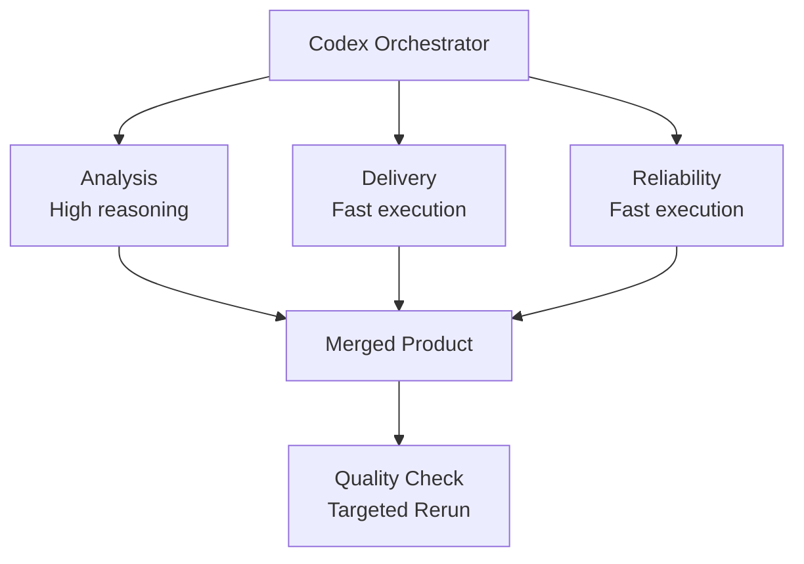

# multiagent-dataanalysis

An end-to-end Excel and CSV analysis system built with FastAPI, Gradio, pandas, and MLflow, assembled by a Codex agent team working in parallel.

## Agent Team Architecture


## What the Project Does

The API accepts `.xlsx`, `.xls`, and `.csv` files and returns workbook-level analysis:

- sheet counts and dataset type inference
- row, column, missing-cell, and duplicate summaries per sheet
- numeric-column summaries and sample row previews
- confidence scoring plus recommendations for cleanup or reporting

The UI provides an upload flow for workbook inspection, while the monitoring layer logs every analysis to `logs/predictions.jsonl` and raises drift alerts when average confidence drops.

## Multi-Agent Structure

The project keeps the same three-part multi-agent layout:

- Analysis pipeline agent: workbook parsing, heuristics, MLflow artifact generation, run comparison
- Deployment agent: FastAPI `/api/analyze` and `/api/health`, schemas, Gradio interface, API tests
- Reliability agent: analysis logging middleware, drift checks, CLI dashboard, grader and rerun logic

This preserves the original orchestration style while removing the old image-analysis domain.

## Agentic Development Benefits



This project demonstrates the business value of agentic development. Instead of treating software delivery as one long sequential task, the system breaks the work into parallel streams with clear ownership: analysis logic, product delivery, and operational reliability. That improves delivery speed, keeps responsibilities separated, and makes the workflow easier to manage.

From a management perspective, the value is not just technical elegance. The value is better use of time and compute budget. High-reasoning capacity is used only for work that affects system quality or design decisions, while structured implementation work is handled by faster, lower-cost profiles. That keeps cost under control without reducing output quality.

This operating model creates a practical delivery advantage:

- faster implementation through parallel execution
- lower cost through smarter model allocation
- clearer ownership across major workstreams
- less rework because grading and checkpoints make corrections targeted
- better predictability because each agent owns a well-defined scope

## Why This Is Operationally Efficient

The project uses task-based routing instead of treating every activity as equally complex. Some work requires deeper reasoning and trade-off judgment, while other work is mainly structured implementation. The orchestrator uses that difference to improve efficiency.

### Higher-value reasoning where it matters

The analysis pipeline agent uses the stronger Codex profile because it handles the parts where a wrong decision is expensive:

- designing workbook quality heuristics
- deciding how confidence should be calculated
- shaping recommendation logic
- choosing what to log into MLflow and how to compare runs

These are decisions with architectural consequences. Using a stronger reasoning profile here reduces downstream rework and improves decision quality.

### Lower-cost execution where structure is already clear

The deployment and reliability agents use the faster Codex profile for work that is more mechanical:

- API route wiring
- schema definitions
- Gradio UI plumbing
- JSONL logging
- dashboard formatting
- scaffold and grading glue

These tasks still matter, but they do not need the same level of expensive reasoning. Using a lighter profile keeps cost lower while still producing correct output quickly.

## Cost-Effective Model Usage

The project is cost-effective because it does not spend premium reasoning capacity on every task.

The routing strategy is simple:

- use the stronger profile only for decisions that affect system behavior or design quality
- use the faster profile for implementation tasks that are already well-bounded
- keep file ownership strict so agents do not overwrite each other and force reruns

This matters in practice because the most expensive part of agentic development is not only token usage, it is wasted cycles and avoidable rework. If a premium model is used for boilerplate, cost rises without meaningful benefit. If a low-cost model is used for architectural reasoning, delivery may slow later due to fixes and redesign. This project avoids both extremes by assigning the cheapest capable profile for each type of work.

## Why The Project Works Well With This Approach

The codebase benefits from this agent split because each part has a different engineering character:

- the analysis layer is logic-heavy and judgment-heavy
- the API and UI layer is integration-heavy and structure-heavy
- the reliability layer is operations-heavy and validation-heavy

That makes it a strong example of why agentic development is useful for medium-sized systems. The project can move faster, stay more organized, and use compute budget more carefully.

## Practical Outcome

By adopting this model-aware agentic workflow, the project gains:

- faster implementation through parallel work
- clearer separation of concerns
- lower cost from smarter profile selection
- fewer merge conflicts because each agent owns specific files
- easier recovery because grading and checkpoints make reruns targeted instead of global

In short, the system is not agentic for presentation value. The workflow directly improves delivery speed, cost efficiency, and execution discipline.

## Project Structure

```text
multiagent-dataanalysis/
├── app/
│   ├── model.py               # Workbook analysis engine
│   ├── routers.py             # /analyze and /health endpoints
│   ├── schemas.py             # Pydantic response models
│   ├── middleware.py          # JSONL analysis logger
│   └── drift_checker.py       # Confidence-based drift detection
├── model/
│   ├── cnn.py                 # Workbook profiling placeholder model
│   ├── train.py               # Batch workbook profiling + MLflow logging
│   └── register_model.py      # Registers workbook profile artifact to MLflow
├── ui/
│   └── app.py                 # Gradio workbook analysis UI
├── tests/
│   └── test_api.py            # API tests for analyze and health endpoints
├── main.py                    # FastAPI app entry point
├── monitor_dashboard.py       # CLI monitoring dashboard
├── compare_runs.py            # MLflow run comparison table
├── grader.py                  # 0-10 project scorer
├── requirements.txt
└── .agent_memory/
```

## Purpose Of `.agent_memory`

The `.agent_memory` folder is the lightweight memory layer for the agentic workflow. It stores structured state that helps the system keep track of what has already been completed, what should run next, and what quality checks have returned.

In this project, it is mainly used for:

- session continuity through `session.json`
- grading results through `grader_result.json`
- reusable structured project facts through files such as `facts.json`

This helps the workflow resume after interruption, rerun only weak stages, and avoid repeating work that has already been completed.

## Evaluation Framework

The project now includes a separate reusable eval layer under `eval_framework/` and `evals/`.

It supports:

- adapter-based evaluation so the same dataset can test multiple implementations
- comparison of the direct Python analyzer and the FastAPI execution path
- JSON and HTML reporting
- optional MLflow logging for eval history
- optional rubric and LLM judge hooks for qualitative scoring
- synthetic test generation for larger benchmark sets
- parallel execution to reduce eval wall-clock time

The main commands are:

```bash
make eval
make eval-compare
make eval-generate
```

For detailed architecture and validation guidance, see [`EVALS.md`](/Users/syedraza/multiagent-dataanalysis/EVALS.md).

## Running the Project

```bash
make install
make serve
make ui
make monitor
make test
make grade
make eval
make eval-compare
```

Optional MLflow flow:

```bash
mlflow server --host 0.0.0.0 --port 5000 \
  --backend-store-uri sqlite:///mlflow.db \
  --default-artifact-root ./mlruns

make train
python model/register_model.py
python compare_runs.py
```

## Technology Stack

| Component | Technology |
|---|---|
| Backend API | FastAPI |
| Workbook parsing | pandas + openpyxl |
| Frontend | Gradio |
| Monitoring | JSONL + tabulate |
| Experiment tracking | MLflow |
| Testing | pytest |

## Eval Notes

- `evals/run_eval.py` runs one adapter against a dataset
- `evals/compare_adapters.py` compares multiple adapters on the same benchmark
- `evals/generate_cases.py` creates larger synthetic eval datasets from sample CSV seeds
- cost, latency, and qualitative judge metadata are included in eval reports
- CI/CD automation is intentionally not part of the current eval scope
